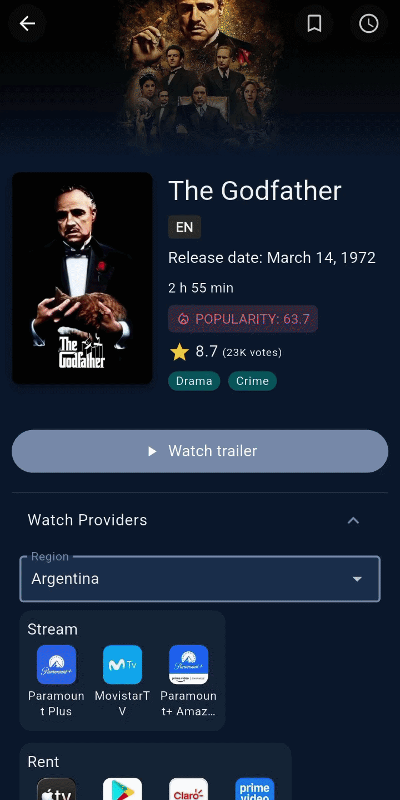

<p align="center">
  
  <br />
  <br />
  <a href="https://sanalb23.github.io/Cine-Scope/">
    
  </a>
</p>

CineScope is a Flutter application for discovering and tracking movies. It uses the TMDB (The Movie Database) API to provide up-to-date movie information. 

The project follows a feature-first structure, with separate data, domain, and presentation layers within each feature. Riverpod is used for state management.

This project was built as a learning experience to practice Flutter development, responsive UI, cross-platform development, deployment, and efficient state management.

## 🚀 Key Features

*   **Movie Discovery & Search**: Browse popular, top-rated, and upcoming movies, or search for specific titles.
*   **Favorites & Watchlist**: Users can save movies to their personal favorites and watchlists for later viewing.
*   **Detailed Movie Information**: Explore movie details, trailers, similar movies, genres, and available streaming providers.
*   **Infinite Scrolling**: Automatically loads more movies as you scroll through lists.
*   **Local Notifications**: Set reminders for upcoming movies, with notifications three days before and on the release date.
*   **Responsive UI**: Adaptive layouts for different screen sizes across Android and Web.
*   **Localization & Theming**: Supports English and Spanish, with Light and Dark themes.
*   **Data & Image Caching**: Optimizes performance and reduces network requests using persistent local storage for static data (genres, watch providers, images) alongside a short-term in-memory cache for dynamic data (movie details and lists).

## 📱 Previews

<p align="center" style="display: flex; gap: 10px;">
  
  
  
  
</p>

---

## 🛠 Tech Stack

*   **Framework**: [Flutter](https://flutter.dev/) (SDK ^3.10.4)
*   **State Management**: [Riverpod](https://riverpod.dev/) (`flutter_riverpod`)
*   **Local Storage**: `shared_preferences`
*   **Networking & API**: `http`, consuming the TMDB API
*   **Data Serialization**: `json_annotation` & `json_serializable`
*   **Localization**: `easy_localization`
*   **Local Notifications**: `flutter_local_notifications`
*   **Deployment**: GitHub Pages

## 📁 Project Structure

```
lib/
├── core/                   # App-wide configurations, theme, utils, globals, and shared providers
└── features/               # Independent feature modules
    ├── home/               # Main navigation, portrait/landscape responsive layouts
    ├── movies/             # Movie data, domain logic, favorites, watchlists, and details UI
    ├── notifications/      # Local notification scheduling and handling
    ├── pagination/         # Reusable pagination logic for continuous scrolling lists
    └── settings/           # App preferences (Theme, Language, etc.)
```

## ⚙️ Getting Started

### Prerequisites
*   Flutter SDK (^3.10.4)
*   A valid [TMDB API Key](https://developer.themoviedb.org/docs/getting-started)

### Installation

1.  **Clone the repository:**
    ```bash
    git clone https://github.com/Sanalb23/Cine-Scope.git
    cd Cine-Scope
    ```

2.  **Install dependencies:**
    ```bash
    flutter pub get
    ```

3.  **Run the App:**
    Pass your TMDB API key using `--dart-define` when running or building the app:
    ```bash
    flutter run --dart-define=TMDB_API_KEY=your_api_key_here
    ```

## 🎬 Credits

CineScope uses the [TMDB API](https://developer.themoviedb.org/) to provide movie and TV show information.
This product uses the TMDB API but is not endorsed or certified by TMDB.

TMDB:
[TMDB](https://www.themoviedb.org/)
